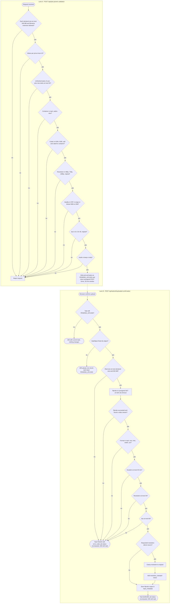

# Input Validation

Validation happens in two places in the api. Lane A validates transcode params when the job is created, before anything is uploaded. Lane B validates the actual video when the browser confirms an upload, so the user finds out right away. Any failure in lane B marks the task FAILED with an error_code. Reflects the Input Validation, Rate Limiting and Job Creation sections of IMPLEMENTATION_NOTES.md.

## Notes

- Lane A rejects the whole request, so nothing is written and no upload urls are issued. Rate limits and the size and count checks belong to the same step.
- The no-upscaling rule needs the source resolution, which is only known after the upload. It is checked at upload confirmation, and a too-high resolution is clamped to original instead of failing the task.
- The presigned POST policy already caps the upload at the declared size, so MinIO rejects anything larger. StatObject is the backstop, and the size stored is always the real one from StatObject.
- A failed validation is still a 200: the request worked, and the task it returns is FAILED with an error. See docs/API.md.
- The worker re-runs ffprobe before transcoding anyway.
- Lane B failure codes: upload_too_large, invalid_input (ffprobe failed), no_video_stream, unsupported_format, duration_too_long, resolution_too_high, fps_too_high, unsupported_codec. upload_timeout is used by cleanup for tasks never uploaded.
