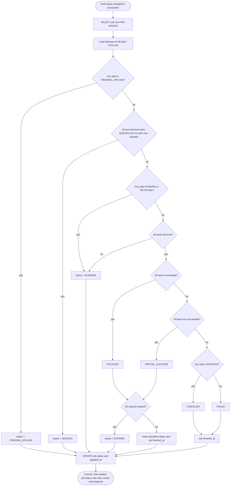

# Job Status Derivation

This flow shows how a job status is recomputed from the statuses of its tasks. It runs inside the same transaction as any task status change, after locking the job row with SELECT ... FOR UPDATE. The checks run in a fixed order: pending uploads, all queued, any running or retrying, then classification once every task is terminal. Reflects the Statuses section of IMPLEMENTATION_NOTES.md.

## Notes

- Succeeded means SUCCESS, or EXPIRED for a task whose output was already cleaned up.
- The check for expired outputs applies only to SUCCESS and PARTIAL_SUCCESS, since FAILED and CANCELED jobs have no outputs to expire.
- "Ever started" means any task has started_at set. A job only shows as QUEUED until its first task starts. After that it stays RUNNING until every task is terminal, even if its remaining tasks are waiting in the queue (per-user fairness, a retry, or a requeue after worker shutdown). Tasks canceled or failed before running have no started_at, so they don't count. This keeps a job from flipping between the Active and Queued dashboard sections.
- CANCELED needs no flag on the job: it is derived from at least one task being CANCELED when none succeeded. Single-task cancel means a batch can mix canceled, failed and succeeded tasks.
- job.status is published even when the status is unchanged but task counts changed. It is not written to the outbox, since the outbox only feeds the Redis stream.
- Events are published to redis only after the postgres commit, since postgres is the source of truth and pub/sub is fire and forget.
