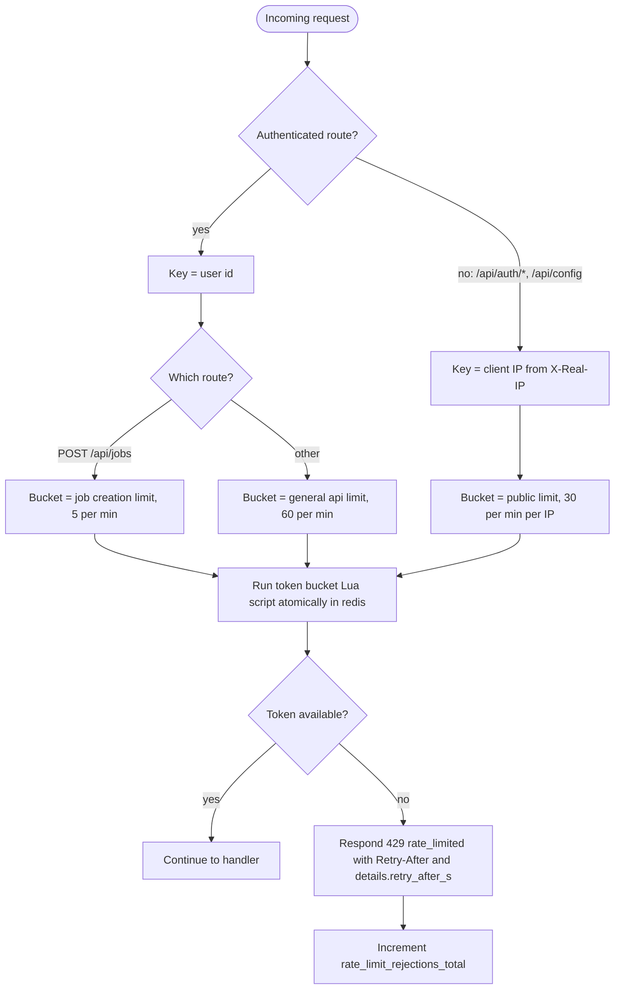

# Rate Limiting

The api middleware identifies the caller, picks the right limit bucket, and runs a token bucket Lua script in redis so that the check and decrement are atomic across api instances. A rejected request gets 429 with a Retry-After header, which the frontend shows to the user. Not every limit lives in the middleware; the table below shows where each one is enforced. Reflects the Rate Limiting and Input Validation sections of IMPLEMENTATION_NOTES.md.

## Notes

- All limits are configurable via env.
- Job creation consumes a token from both the general bucket and the job creation bucket.
- All limits are reported to the frontend by GET /api/config. Error body shape is in docs/API.md.
- Limits and where they are enforced:

| Limit | Value | Enforced in |
|-------|-------|-------------|
| General api | 60 requests/min per user | api rate limit middleware |
| Public routes | 30 requests/min per IP | api rate limit middleware |
| Job creation | 5 jobs/min per user | api middleware, job creation handler |
| Videos per job | 10 | input validation at POST /api/jobs |
| Unfinished tasks per user | 50 (PENDING_UPLOAD, QUEUED, RUNNING, RETRYING), 429 quota_exceeded past that | job creation handler |
| Tasks in flight per user | 2: (QUEUED and dispatched_at set) or RUNNING | scheduler dispatcher, not the middleware |
| SSE connections per user | 5 | api SSE handler (GET /api/events), Redis counter |
| Max file size | 500 MB | presigned POST policy, plus StatObject at POST /api/tasks/{id}/uploaded |
| Max duration | 30 min | input validation at POST /api/tasks/{id}/uploaded |
| Daily input minutes quota | maybe, optional | not decided |
