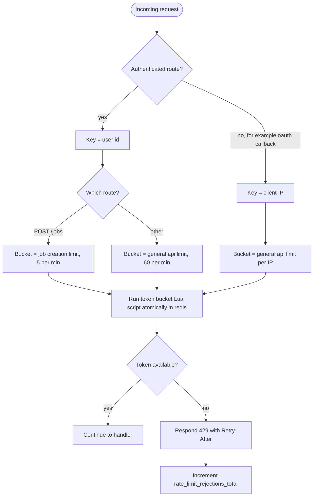

# Rate Limiting

The api middleware identifies the caller, picks the right limit bucket, and runs a token bucket Lua script in redis so that the check and decrement are atomic across api instances. A rejected request gets 429 with a Retry-After header, which the frontend shows to the user. Not every limit lives in the middleware; the table below shows where each one is enforced. Reflects the Rate Limiting and Input Validation sections of IMPLEMENTATION_NOTES.md.

## Notes

- All limits are configurable via env.
- Job creation is assumed to consume a token from both the general bucket and the job creation bucket. The notes only say the limits exist.
- Limits and where they are enforced:

| Limit | Value | Enforced in |
|-------|-------|-------------|
| General api | 60 requests/min per user, unauthenticated routes per IP | api rate limit middleware |
| Job creation | 5 jobs/min per user | api middleware, job creation handler |
| Videos per job | 10 | input validation at POST /jobs |
| Queued tasks per user | 50, job creation rejected past that | job creation handler, input validation at POST /jobs |
| Tasks in flight per user | 2 (dispatched or running) | scheduler dispatcher, not the middleware |
| SSE connections per user | 5 | api SSE handler (GET /events) |
| Max file size | 2GB | input validation at POST /tasks/{id}/uploaded |
| Max duration | 30 min | input validation at POST /tasks/{id}/uploaded |
| Daily input minutes quota | maybe, optional | not decided |
