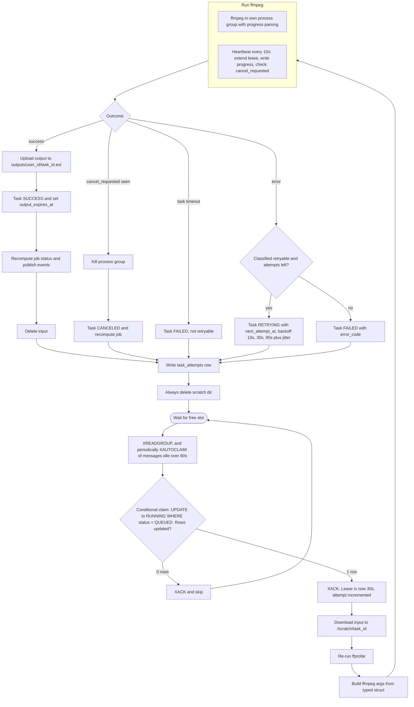

# Worker Task Lifecycle

This is the loop of a single worker slot, from waiting for capacity to cleaning up scratch space. A slot only reads from the stream when it is free, and the conditional claim in postgres is what guarantees one owner per task. Note the parallel heartbeat during ffmpeg, the five outcome branches, and that the scratch directory is always deleted. Reflects the Queue, CPU Management, Progress, Storage and Statuses sections of IMPLEMENTATION_NOTES.md.

## Notes

- A crashed worker never reaches the outcome branches. The lease expires and the lease reaper moves the task to RETRYING or FAILED and writes a task_attempts row with outcome lease_expired.
- Progress is published to redis at most once per second and written to postgres only on the heartbeat. Status changes are written to postgres first, then published.
- The input object is deleted once the task is terminal. A RETRYING task keeps its input, since the retry needs it.
- Task timeout is max of 10 min and 3 times the input duration.
- Graceful shutdown on SIGTERM stops reading and kills ffmpeg, then returns the task to QUEUED without counting the attempt. It is a separate path from the per-task loop, so it is drawn in 12-worker-graceful-shutdown.md instead of here.
- The ffmpeg and heartbeat subgraph runs concurrently. The heartbeat can also stop the run when it finds cancel_requested.
