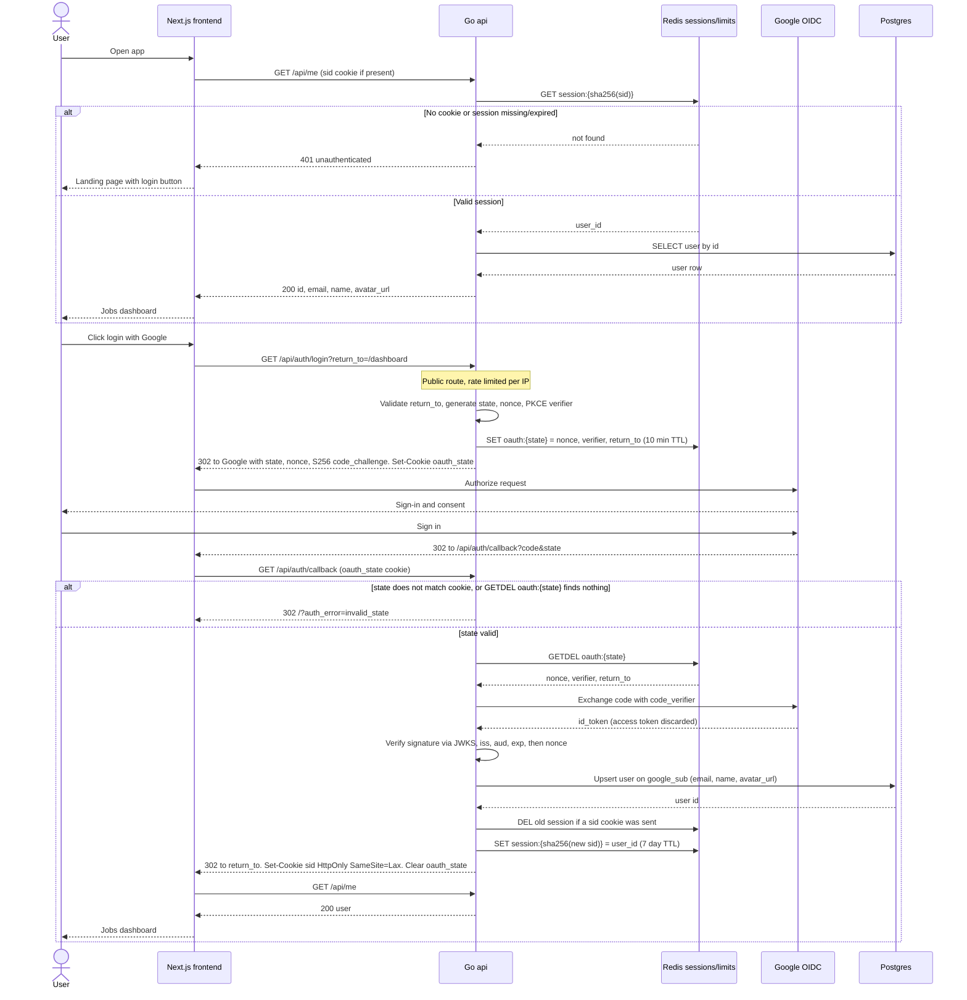

# Login and Account Creation

Login and account creation are one flow. The api runs the Google OIDC authorization code flow with PKCE, state and nonce, upserts the user on `google_sub`, and creates a 7 day session in Redis. The first half shows the initial `GET /api/me` check that decides between the landing page and the dashboard. No Google tokens are stored, since the app only needs to know who the user is. All traffic goes through nginx on one origin (not drawn). Reflects the Auth and UI sections of IMPLEMENTATION_NOTES.md and docs/OAUTH.md.

## Notes
- No Google access or refresh tokens are stored anywhere.
- Existing users get name, email and avatar refreshed by the upsert. `google_sub` is the identity key because email can change.
- The `oauth_state` cookie ties the callback to the browser that started the login, which blocks login CSRF. GETDEL makes each state single use.
- Callback failures are redirects to `/?auth_error=<code>`, never JSON, because the callback is a browser navigation.
- Logout is `POST /api/auth/logout`: delete the session key, clear the cookie, answer 204.
