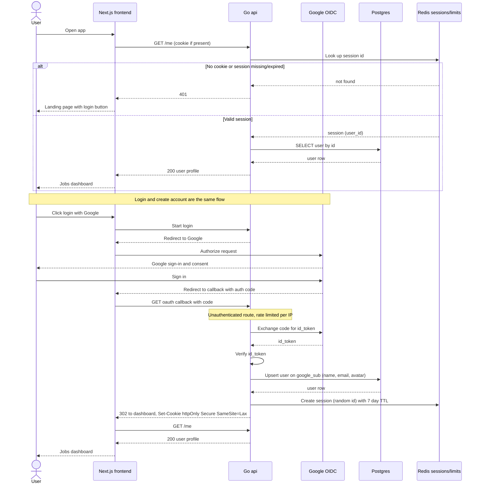

# Login and Account Creation

Login and account creation are one flow: the api runs the Google OIDC exchange, upserts the user on `google_sub`, and creates a 7 day session in Redis. The first half shows the initial `GET /me` check that decides between the landing page and the dashboard. Note that no Google tokens are stored, since the app only needs to know who the user is. Reflects the Auth, UI, "Account Creation" and "Login" sections of IMPLEMENTATION_NOTES.md.

## Notes
- No Google access or refresh tokens are stored anywhere.
- Existing users get name, email and avatar refreshed by the upsert. `google_sub` is the identity key because email can change.
- The code to id_token exchange step is implied by the Google OIDC flow, the notes only say the api verifies the id_token.
