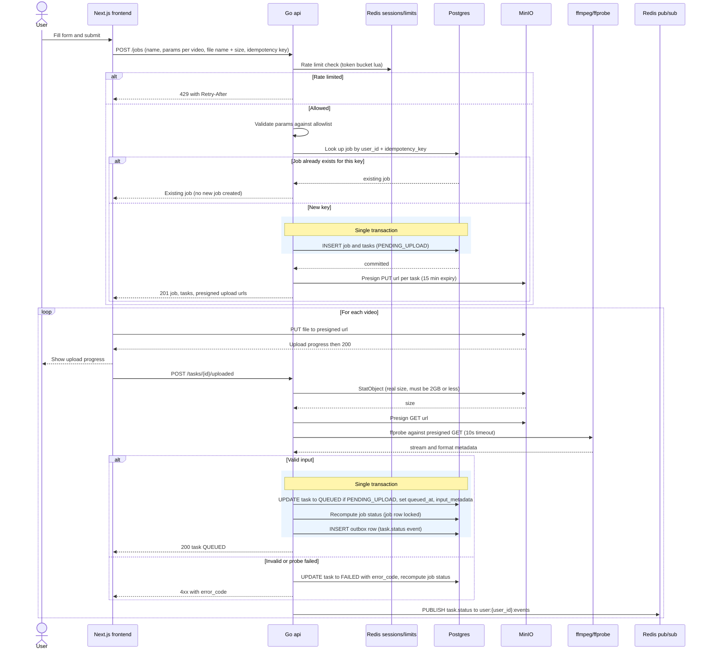

# Job Creation and Upload

The user submits a job, the api validates and writes the job and its tasks as PENDING_UPLOAD in one transaction, and returns presigned PUT urls. The browser then uploads each video straight to MinIO (never through the api) and confirms each one, which triggers server side validation and the move to QUEUED. Reflects the Job Creation, Storage, Input Validation, Rate Limiting and Progress sections of IMPLEMENTATION_NOTES.md.

## Notes
- Validation checks: size at most 2GB, ffprobe succeeds, at least one video stream, format in mp4/mov/mkv/webm/avi, duration at most 30 min, resolution at most 4K, fps at most 60.
- Rate limits applied here include 5 jobs/min per user, 10 videos per job and 50 queued tasks per user. All are checked before the transaction.
- The notes list the outbox row only in the QUEUED branch of validation. The task.status publish to the user channel is shown for both branches.
- The dispatcher later pushes the QUEUED task to the stream, see diagram 03.
