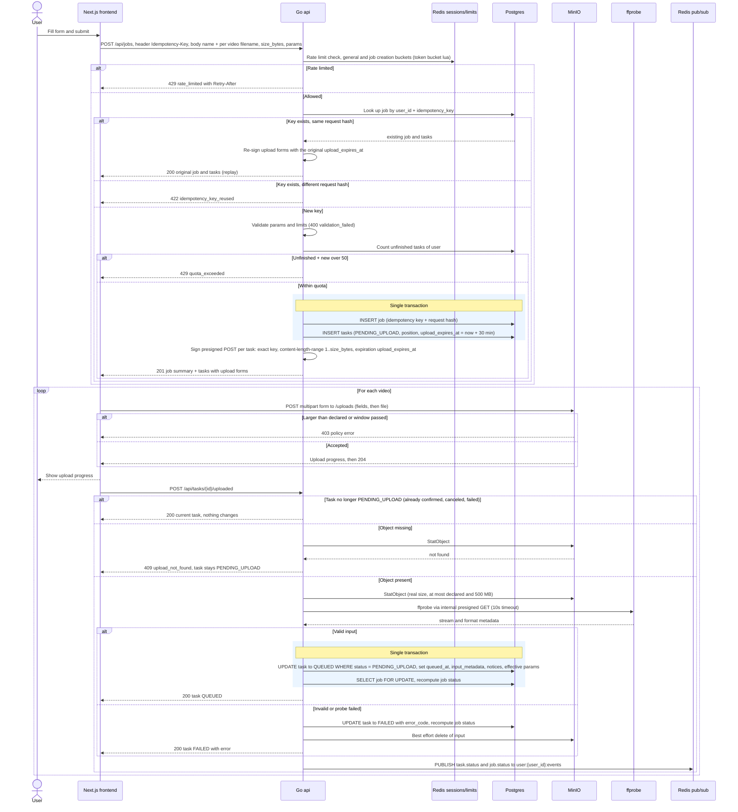

# Job Creation and Upload

The user submits a job. The api checks the idempotency key, validates, writes the job and its tasks as PENDING_UPLOAD in one transaction, and returns one presigned POST form per task with a 30 min upload window. The browser then uploads each video straight to MinIO through nginx (never through the api) and confirms each one. Confirming triggers server side validation and the move to QUEUED, and the response always reports the task's resulting status. Reflects the Job Creation, Storage, Input Validation and Rate Limiting sections of IMPLEMENTATION_NOTES.md and docs/API.md.

## Notes
- Validation checks: size at most the declared size and 500 MB, ffprobe succeeds, at least one video stream, format in mp4/mov/mkv/webm/avi, duration at most 30 min, resolution at most 4K, fps at most 60.
- No outbox row is written here. The outbox only feeds the Redis stream, and only the dispatcher writes to it (diagram 03). Status events go straight to pub/sub after commit.
- There is no route for a new upload form. Once the window passes, cleanup fails the task with upload_timeout (diagram 11).
- The browser upload goes through nginx to MinIO. The api signs it with the public MinIO endpoint, see docs/NGINX.md.
