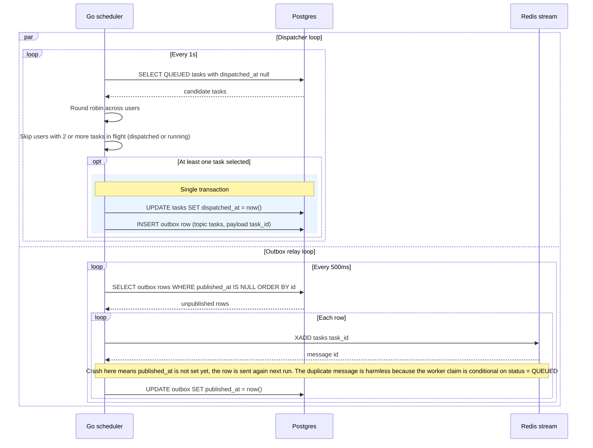

# Dispatch and Outbox Relay

Two independent loops in the single scheduler instance move QUEUED tasks onto the Redis stream. The dispatcher decides who goes next (round robin across users, at most 2 in flight per user) and records that decision plus an outbox row in one transaction. The outbox relay then publishes outbox rows to the stream, which avoids the dual write problem. Reflects the "Scheduler loops" and "Queue" sections of IMPLEMENTATION_NOTES.md.

## Notes
- The stream message carries only the task_id. The worker loads everything else from Postgres.
- Writing the state change and the outbox row in one transaction means a task can never be marked dispatched without a message eventually reaching the stream.
- If Redis is wiped, the queue can be rebuilt from Postgres (QUEUED tasks and the outbox).
- The retry scheduler clears dispatched_at on retried tasks so this dispatcher picks them up again.
