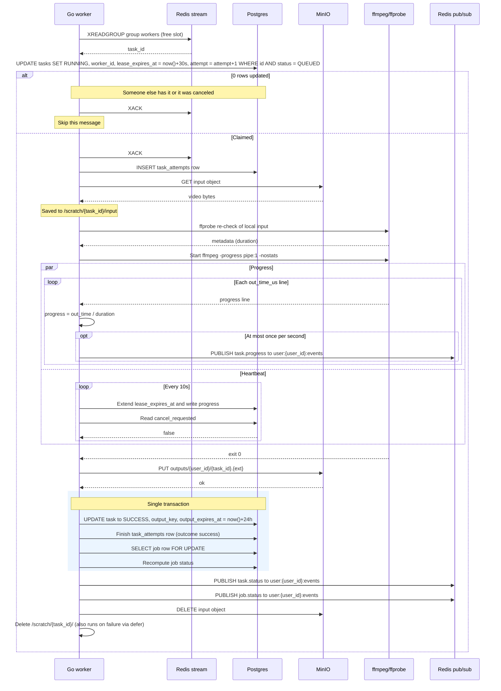

# Task Processing (Success Path)

A worker with a free slot reads a task id from the stream, claims it with a conditional update in Postgres, runs ffmpeg while streaming progress and heartbeating, then uploads the output and finalizes everything in one transaction. Note the two concurrent activities during ffmpeg: throttled progress publishing to Redis and the 10s heartbeat that writes to Postgres. Reflects the Queue, Storage, Progress and Statuses sections of IMPLEMENTATION_NOTES.md.

## Notes
- XACK happens right after the claim because the Postgres lease is the guarantee from then on. If the worker dies later the lease expires and the reaper handles it.
- ffmpeg runs in its own process group with a timeout of max(10 min, 3x input duration).
- Status changes are always written to Postgres first and published second.
- If the heartbeat sees cancel_requested = true, the worker kills ffmpeg and the task goes to CANCELED. That branch is not drawn here, this diagram is the success path only.
- Input is deleted only once the task is terminal because retries need it.
