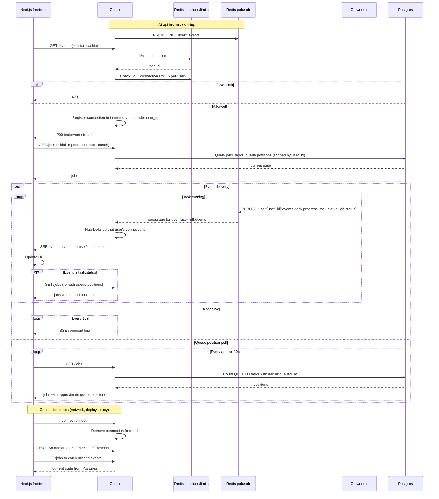

# Progress Updates over SSE

The browser opens one EventSource to `GET /events`. Each api instance holds a single Redis `PSUBSCRIBE user:*:events` and fans messages out in memory to that user's connections only. Redis pub/sub is fire and forget, so Postgres stays the source of truth and the browser refetches `GET /jobs` on reconnect and for queue positions. Reflects the Progress, UI and Queue sections of IMPLEMENTATION_NOTES.md.

## Notes
- Queue position is computed when `GET /jobs` runs and is never pushed over SSE. It is approximate because per-user fairness lets other tasks skip ahead.
- Events carried over SSE are task.status, task.progress and job.status. Progress is throttled to at most 1 per second per task by the worker.
- Workers never talk to the api directly. They only write to Postgres and publish to Redis.
- Losing a pub/sub message is acceptable since the reconnect refetch and the periodic poll restore the truth from Postgres.
