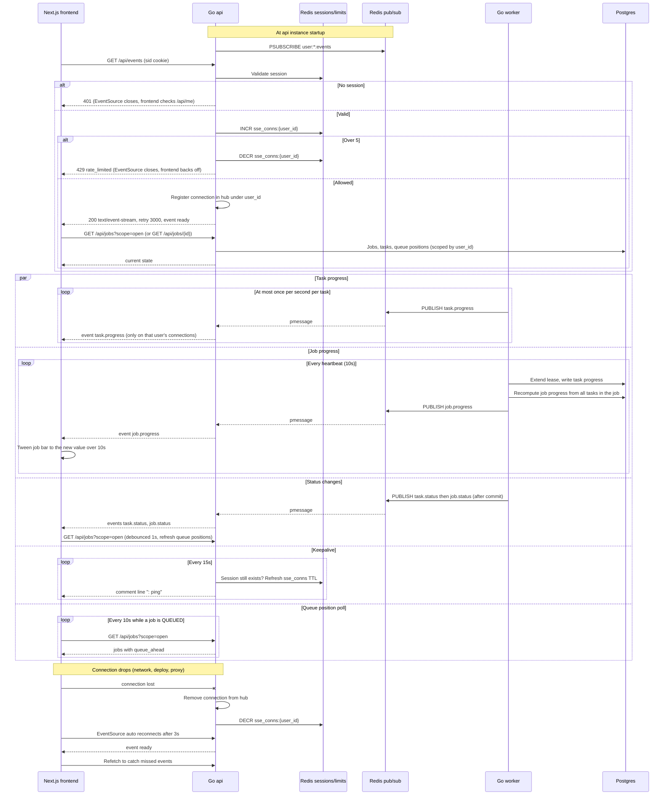

# Progress Updates over SSE

The browser opens one EventSource to `GET /api/events`. Each api instance holds a single Redis `PSUBSCRIBE user:*:events` and fans messages out in memory to that user's connections only. Redis pub/sub is fire and forget, so Postgres stays the source of truth: the browser refetches whenever it receives a `ready` event, which happens on every connect and reconnect, and polls for queue positions. Payloads are defined in docs/SSE.md. Reflects the Progress, UI and Queue sections of IMPLEMENTATION_NOTES.md.

## Notes
- Queue position is computed when `GET /api/jobs` runs and is never pushed over SSE. It is approximate because per-user fairness lets other tasks skip ahead.
- Events: ready, task.status, task.progress, job.status, job.progress. Every task and job event carries job_id.
- The client drops events older than the latest `ts` it has for a task or job, and drops progress events from older attempts.
- Workers never talk to the api directly. They only write to Postgres and publish to Redis.
- If the session disappears (logout or expiry), the next keepalive closes the stream, and the reconnect gets a 401.
