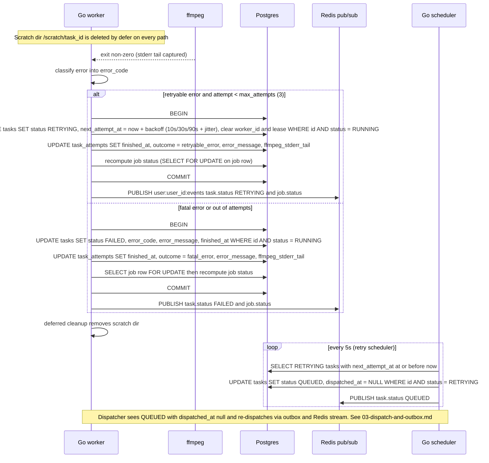

# Task Failure and Retry

Shows what happens when ffmpeg exits non-zero. The worker classifies the failure into an error_code, then either schedules a retry (RETRYING with backoff of 10s, 30s, 90s plus jitter) or marks the task FAILED when the error is fatal or all 3 attempts are used. The scheduler's retry loop later moves the task back to QUEUED and the dispatcher picks it up again. Reflects the Statuses, Queue, Scheduler loops and Storage sections of IMPLEMENTATION_NOTES.md.

## Notes
- Retryable codes: lease expired, ffmpeg killed by signal or OOM, MinIO or Postgres timeouts. Not retryable: invalid or corrupt input, unsupported codec, decode error, timeout, canceled.
- Status changes are written to Postgres first, then published. Pub/sub is fire and forget.
- The input object is kept while retries are possible and deleted once the task is terminal.
