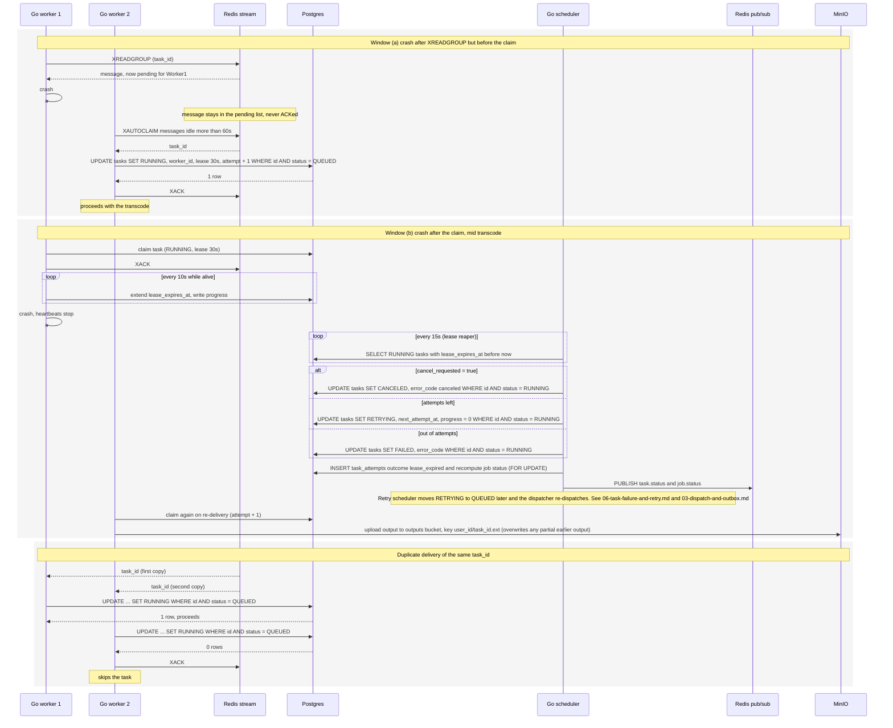

# Worker Crash Recovery

Covers the two places a worker can die plus duplicate delivery. Window (a) is between XREADGROUP and the Postgres claim, where the message is left pending and another worker takes it with XAUTOCLAIM after 60s idle. Window (b) is after the claim, where heartbeats stop and the lease reaper retries or fails the task. The last section shows the same task_id delivered twice and the conditional claim making the second delivery a no-op. Reflects the Queue and Scheduler loops sections of IMPLEMENTATION_NOTES.md.

## Notes
- The output key is deterministic (bucket outputs, key {user_id}/{task_id}.{ext}), so a rerun simply overwrites any earlier partial or complete output.
- XACK happens right after the claim because the Postgres lease is the guarantee from then on.
- The reaper checks cancel_requested first. A worker that died mid cancel must not have its task retried.
- The outbox relay can also cause duplicates (crash between XADD and setting published_at). The same conditional claim handles it.
