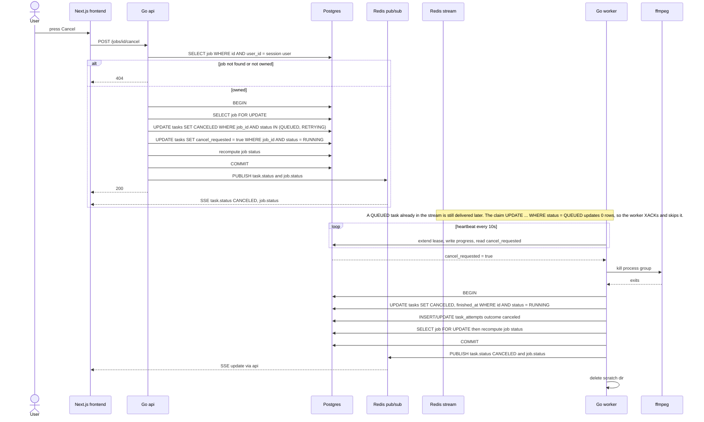

# Cancel Job

The user cancels a job. In one transaction the API moves QUEUED and RETRYING tasks straight to CANCELED and flags RUNNING tasks with cancel_requested. The worker notices the flag on its next heartbeat (within 10s), kills the ffmpeg process group and finishes the cancel with a conditional update. Reflects the Cancel Job interaction, Statuses, Queue and CPU Management sections of IMPLEMENTATION_NOTES.md.

## Notes
- If the task finishes (SUCCESS) between the API flagging it and the worker noticing, the worker's conditional update decides which transition wins.
- Cancel is not retryable, so the task never goes to RETRYING.
- The API only forwards pub/sub events to the browser. Workers never talk to the API directly.
