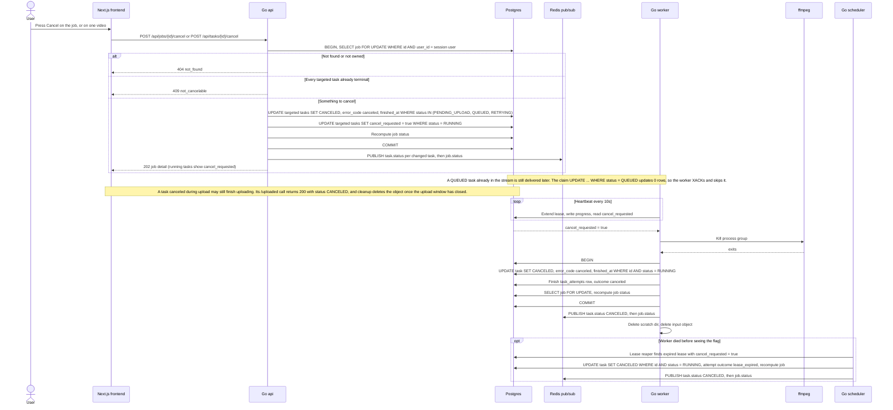

# Cancel Job or Task

The user cancels a whole job or a single video. In one transaction the api moves PENDING_UPLOAD, QUEUED and RETRYING tasks straight to CANCELED and flags RUNNING tasks with cancel_requested. The worker notices the flag on its next heartbeat (within 10s), kills the ffmpeg process group and finishes the cancel with a conditional update. If the worker dies before that, the lease reaper finishes the cancel. Reflects the Cancel Job interaction, Statuses, Queue and CPU Management sections of IMPLEMENTATION_NOTES.md and docs/API.md.

## Notes
- If the task finishes (SUCCESS) between the api setting the flag and the worker noticing it, the worker's conditional update decides which transition wins.
- Cancel is not retryable, so a canceled task never goes to RETRYING. The reaper checks cancel_requested before deciding between RETRYING and FAILED.
- Calling cancel again while a running task is still canceling returns 202, so double clicks are harmless.
- The api only forwards pub/sub events to the browser. Workers never talk to the api directly.
