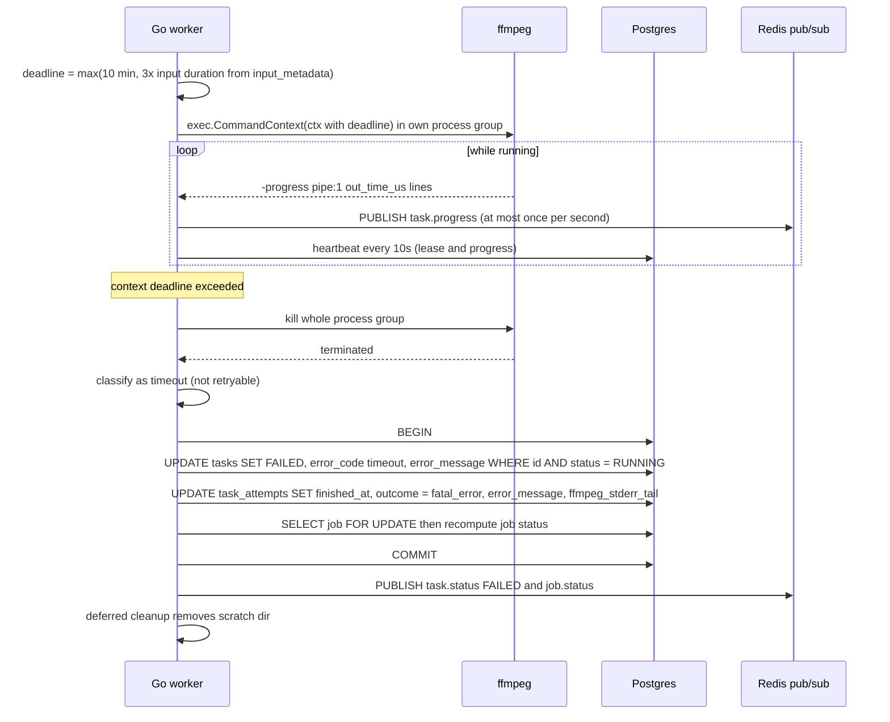

# Task Timeout

Shows how a runaway transcode is stopped. ffmpeg runs under exec.CommandContext with a deadline of max(10 min, 3x input duration) in its own process group. When the deadline hits, the whole group is killed and the task goes straight to FAILED with error_code timeout, since the same input would just time out again. Reflects the CPU Management and Statuses sections of IMPLEMENTATION_NOTES.md.

## Notes
- No retry is scheduled even if attempts remain.
- Timeout is a deadline on wall-clock time, so a slow server makes it more likely. Encoder presets are chosen with that in mind (see the CPU Management section of the notes).
- The task_attempts outcome value fatal_error is used because the allowed outcomes are success, retryable_error, fatal_error, lease_expired, canceled, interrupted. The timeout detail lives in error_code and error_message.
