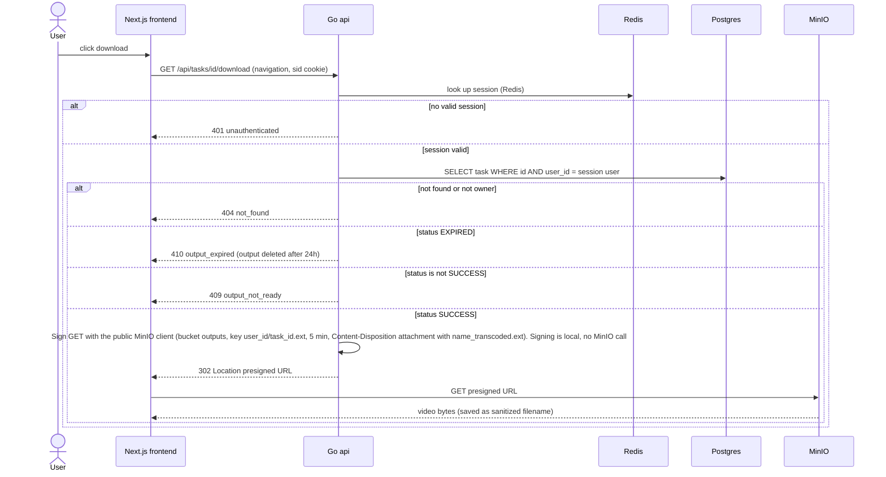

# Download

The user downloads a finished output. The download goes through the API so ownership can be checked, then the API answers with a 302 redirect to a short-lived presigned MinIO URL and the browser fetches the file directly from MinIO. Other users' tasks return 404 and expired outputs have no link. Reflects the Storage, Auth and Download sections of IMPLEMENTATION_NOTES.md.

## Notes
- The session is looked up in Redis. Video bytes never pass through the Go api. The browser fetches the file from MinIO through nginx at /outputs/..., see docs/NGINX.md.
- The frontend only renders the link while the task is SUCCESS, so the 409 and 410 cases are rare and show up as plain JSON pages.
- Outputs are kept 24h (output_expires_at). After cleanup the task is EXPIRED and the UI shows no link.
