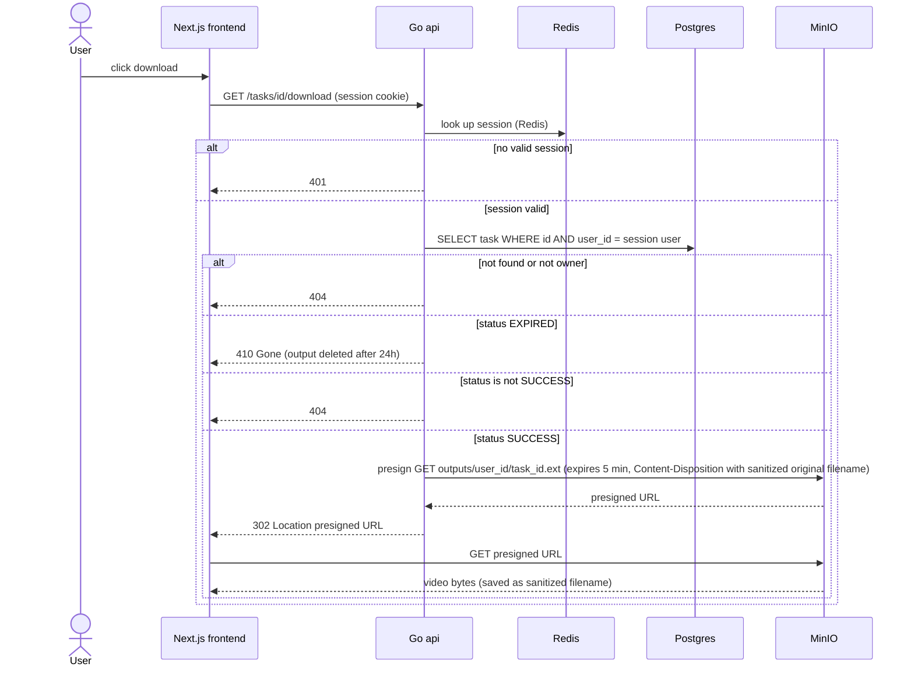

# Download

The user downloads a finished output. The download goes through the API so ownership can be checked, then the API answers with a 302 redirect to a short-lived presigned MinIO URL and the browser fetches the file directly from MinIO. Other users' tasks return 404 and expired outputs have no link. Reflects the Storage, Auth and Download sections of IMPLEMENTATION_NOTES.md.

## Notes
- The session is looked up in Redis. Video bytes never pass through the Go api.
- Outputs are kept 24h (output_expires_at). After cleanup the task is EXPIRED and the UI shows no link.
