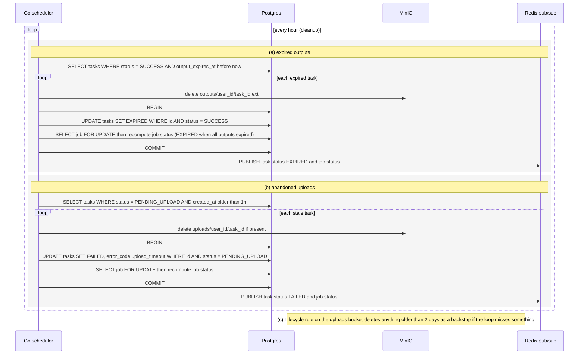

# Cleanup

The scheduler's cleanup loop runs every hour and handles two cases. Expired outputs (SUCCESS past output_expires_at) are deleted from MinIO and the task becomes EXPIRED. Uploads that never completed (PENDING_UPLOAD older than 1h) are cleaned up and failed with upload_timeout. A MinIO lifecycle rule is a backstop. Reflects the Storage, Scheduler loops and Statuses sections of IMPLEMENTATION_NOTES.md.

## Notes
- Every transition is a conditional update, so cleanup cannot clobber a task that changed state in the meantime.
- Delete-then-update order means a crash in between is safe: the next run finds the task still SUCCESS and deleting a missing object is harmless.
