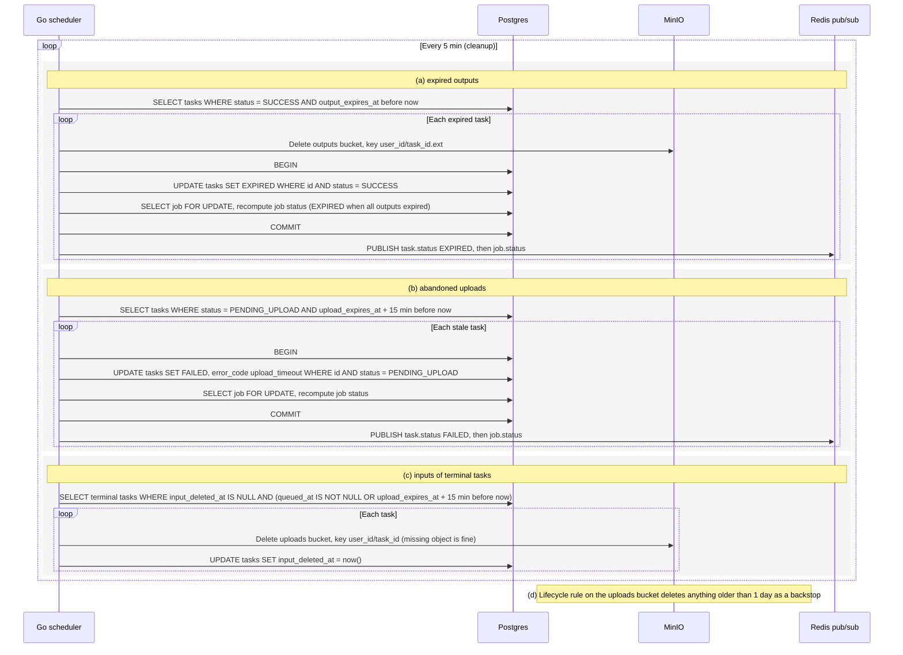

# Cleanup

The scheduler's cleanup loop runs every 5 minutes and handles three cases. Expired outputs (SUCCESS past output_expires_at) are deleted from MinIO and the task becomes EXPIRED. Uploads that were never confirmed (PENDING_UPLOAD 15 min past their upload window) are failed with upload_timeout. Inputs of terminal tasks are deleted as soon as no upload can still land. A MinIO lifecycle rule is a backstop. Reflects the Storage, Scheduler loops and Statuses sections of IMPLEMENTATION_NOTES.md.

## Notes
- Every status transition is a conditional update, so cleanup cannot clobber a task that changed state in the meantime.
- Delete-then-update order means a crash in between is safe. The next run finds the task unchanged, and deleting a missing object is harmless.
- Why (c) waits: a task canceled or failed while still PENDING_UPLOAD may have an upload in flight that lands after a delete. A task that reached QUEUED (queued_at set) finished uploading, so nothing can land later. Otherwise cleanup waits until the upload window and grace period have passed, so no new object can appear after the final delete.
- The worker deletes the input right away on SUCCESS and sets input_deleted_at itself, so (c) mostly handles canceled, failed and timed-out tasks.
- Running every 5 minutes keeps outputs at roughly 24h and abandoned uploads at roughly 50 min at most.
