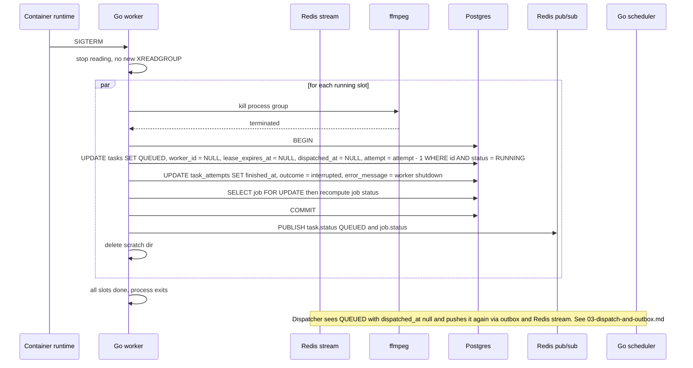

# Worker Graceful Shutdown

On SIGTERM the worker stops pulling new messages, kills every running ffmpeg process group and puts those tasks back to QUEUED without counting the attempt, then exits. It does not wait for transcodes to finish because they can be long. The dispatcher later re-dispatches the requeued tasks. Reflects the CPU Management (graceful shutdown) and Queue sections of IMPLEMENTATION_NOTES.md.

## Notes
- Decrementing attempt means a deploy or restart never burns one of the 3 attempts.
- If the worker is killed before finishing (for example SIGKILL after the grace period), the normal lease reaper path in 07-worker-crash-recovery.md applies.
