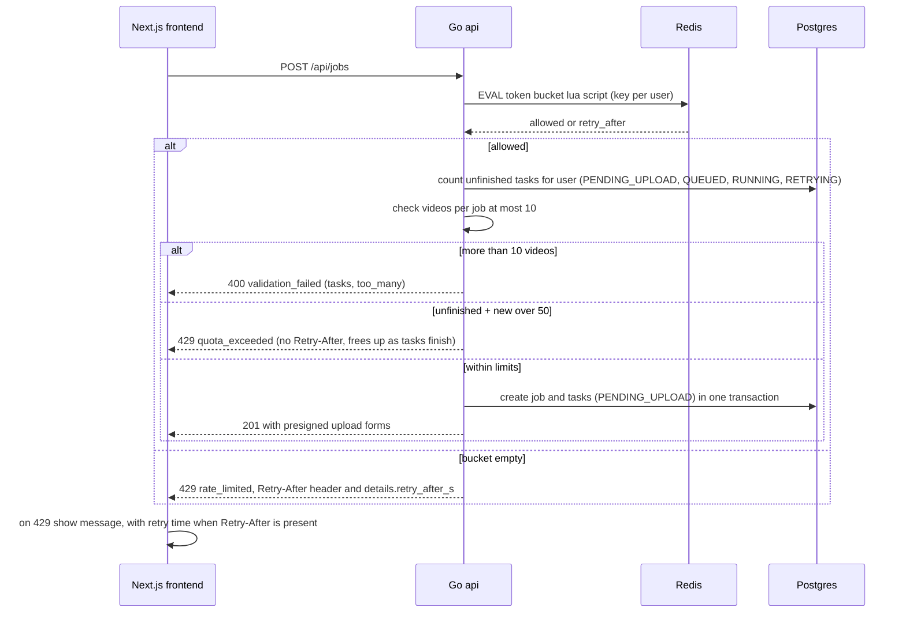

# Rate Limited Request

Shows POST /api/jobs passing through the rate limit middleware. A Redis Lua token bucket keyed by user makes the check and decrement atomic across API instances. Allowed requests also face the handler-level limits (max 50 unfinished tasks per user, max 10 videos per job). Token bucket rejections return 429 rate_limited with Retry-After and the frontend shows when the user can try again. Reflects the Rate Limiting and UI sections of IMPLEMENTATION_NOTES.md.

## Notes
- Job creation uses a 5 jobs per minute per user bucket on top of the general 60 requests per minute per user bucket. Limits are configurable via env.
- Each rejection increments rate_limit_rejections_total by limit.
