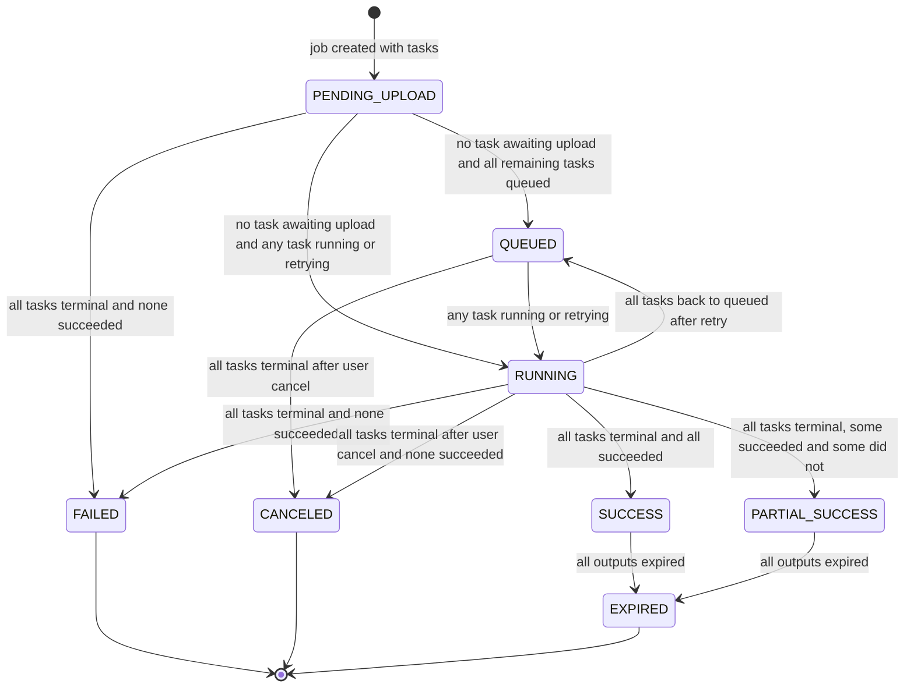

# Job State Machine

A job is what the user submits and is made of one or more tasks. Job status is derived from its tasks and is never set directly. It is recomputed in the same transaction as every task status change, using SELECT ... FOR UPDATE on the job row so that two workers finishing the last two tasks of a batch cannot race. Each transition below is labeled with the task condition that produces it. Reflects the Statuses section of IMPLEMENTATION_NOTES.md.

## Notes

- Derivation order: any task awaiting upload gives PENDING_UPLOAD, then all queued gives QUEUED, then any running or retrying gives RUNNING, then once all tasks are terminal the result is classified. See `job-status-derivation.md` for the full decision flow.
- The notes do not list job transitions explicitly, so the edges here are those that the derivation rules can produce from task changes.
- SUCCESS and PARTIAL_SUCCESS are not final, because cleanup expires outputs after 24h.
