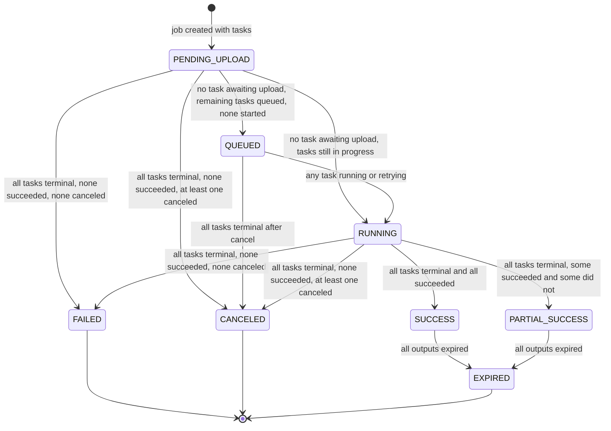

# Job State Machine

A job is what the user submits and is made of one or more tasks. Job status is derived from its tasks and is never set directly. It is recomputed in the same transaction as every task status change, using SELECT ... FOR UPDATE on the job row so that two workers finishing the last two tasks of a batch cannot race. Each transition below is labeled with the task condition that produces it. Reflects the Statuses section of IMPLEMENTATION_NOTES.md.

## Notes

- Derivation order: any task awaiting upload gives PENDING_UPLOAD, then all non-terminal tasks queued with none ever started gives QUEUED, then anything still in progress gives RUNNING, then once all tasks are terminal the result is classified. See `job-status-derivation.md` for the full decision flow.
- CANCELED means no task succeeded and at least one task was canceled. Cancel can target a single task, so a batch where one video was canceled and the rest succeeded ends as PARTIAL_SUCCESS. No extra column is needed on jobs.
- The dashboard shows PENDING_UPLOAD and RUNNING jobs under Active, and QUEUED jobs under Queued.
- There is no RUNNING -> QUEUED edge. Once any task has started (started_at set), the job stays RUNNING until it is terminal, so it never moves back from Active to Queued.
- SUCCESS and PARTIAL_SUCCESS are not final, because cleanup expires outputs after 24h.
