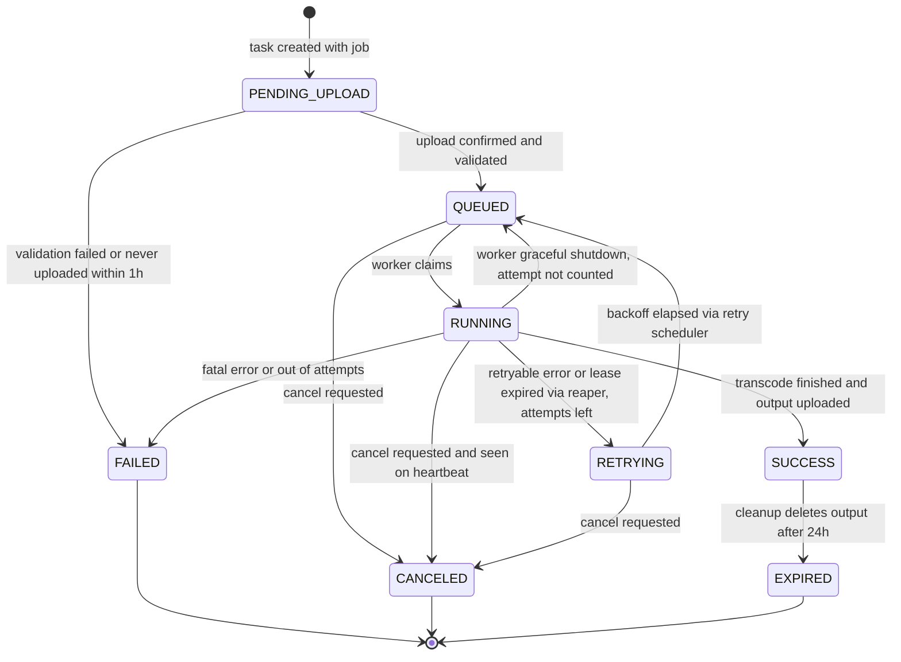

# Task State Machine

A task is one video inside a job. This diagram shows every allowed task status transition and what triggers it; any transition not drawn here is rejected. Every transition is a conditional update of the form UPDATE ... WHERE id = $1 AND status = expected, so two actors racing on the same task cannot both win. SUCCESS leads to EXPIRED once cleanup deletes the output, so it is not itself terminal. Reflects the Statuses, Queue, Scheduler loops and Storage sections of IMPLEMENTATION_NOTES.md.

## Notes

- Every transition is a conditional `UPDATE ... WHERE id = $1 AND status = <expected>`. Zero rows updated means someone else won the race and the caller backs off.
- Job status is recomputed in the same transaction as each task transition.
- RUNNING -> QUEUED only happens on worker graceful shutdown. The attempt is decremented so a deploy doesn't burn a retry. See 12-worker-graceful-shutdown.md.

| From | To | Trigger | Actor |
|------|----|---------|-------|
| PENDING_UPLOAD | QUEUED | upload confirmed and validated (POST /tasks/{id}/uploaded) | api |
| PENDING_UPLOAD | FAILED | validation failed at upload confirmation | api |
| PENDING_UPLOAD | FAILED | never uploaded within 1h (error_code upload_timeout) | scheduler (cleanup) |
| QUEUED | RUNNING | worker claims after XREADGROUP | worker |
| QUEUED | CANCELED | user cancels job | api |
| RUNNING | SUCCESS | output uploaded, output_expires_at set | worker |
| RUNNING | RETRYING | retryable error, attempts left | worker |
| RUNNING | RETRYING | lease expired via reaper, attempts left | scheduler (lease reaper) |
| RUNNING | FAILED | fatal error, task timeout, or out of attempts | worker |
| RUNNING | FAILED | lease expired via reaper, out of attempts | scheduler (lease reaper) |
| RUNNING | CANCELED | cancel_requested seen on heartbeat, ffmpeg killed | worker |
| RUNNING | QUEUED | worker graceful shutdown (SIGTERM), attempt decremented, outcome interrupted | worker |
| RETRYING | QUEUED | backoff elapsed, dispatched_at cleared | scheduler (retry scheduler) |
| RETRYING | CANCELED | user cancels job | api |
| SUCCESS | EXPIRED | cleanup deletes output past output_expires_at | scheduler (cleanup) |
