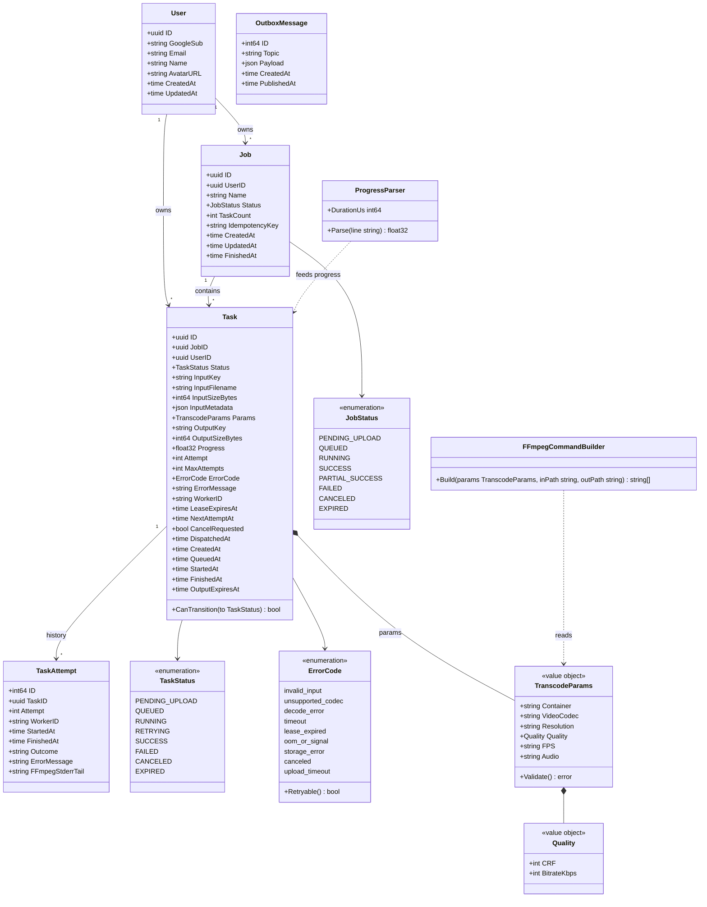

# Class Diagrams

Two diagrams are shown. The first is the Go domain model: entities mirroring the tables, the status and error enums, and the TranscodeParams value object with its ffmpeg and progress helpers. The second is the service layer: repository and infrastructure interfaces, the worker, the scheduler loops, and the API SSE hub. These reflect the "Database Schema", "Statuses", "Queue", "Scheduler loops", "Input Validation" and "Progress" sections of IMPLEMENTATION_NOTES.md.

## Domain model

## Services and infrastructure

```mermaid
classDiagram
    class JobRepository {
        <<interface>>
        +Create(job, tasks) error
        +Get(userID, jobID) Job
        +ListByCursor(userID, createdAt, limit) Job[]
        +RecomputeStatus(jobID) JobStatus
    }

    class TaskRepository {
        <<interface>>
        +Get(userID, taskID) Task
        +Transition(id, from, to) bool
        +Claim(id, workerID, lease) bool
        +ExtendLease(id, lease, progress) error
        +ListExpiredLeases() Task[]
        +ListRetryDue() Task[]
        +ListUndispatched() Task[]
        +ListOutputsExpired() Task[]
        +QueuePosition(id) int
        +AddAttempt(attempt) error
    }

    class OutboxRepository {
        <<interface>>
        +Insert(tx, topic, payload) error
        +ListUnpublished(limit) OutboxMessage[]
        +MarkPublished(id) error
    }

    class Queue {
        <<interface>>
        +Add(taskID) error
        +Read(consumer) string
        +Ack(id) error
        +AutoClaim(minIdle) string[]
    }

    class EventPublisher {
        <<interface>>
        +Publish(userID, event) error
    }

    class ObjectStorage {
        <<interface>>
        +PresignPut(key, ttl) string
        +PresignGet(key, ttl, filename) string
        +Stat(key) ObjectInfo
        +Download(key, path) error
        +Upload(path, key) error
        +Delete(key) error
    }

    class RateLimiter {
        <<interface>>
        +Allow(key, limit) Decision
    }

    class SessionStore {
        <<interface>>
        +Create(userID) string
        +Get(sessionID) uuid
        +Delete(sessionID) error
    }

    class Worker {
        +string ID
        +int Slots
        +int FFmpegThreads
        +Run(ctx) error
        -runTask(taskID) error
        -heartbeat(taskID) error
        +Shutdown() void
    }

    class OutboxRelay {
        +Run(ctx) error
    }
    class Dispatcher {
        +Run(ctx) error
    }
    class LeaseReaper {
        +Run(ctx) error
    }
    class RetryScheduler {
        +Run(ctx) error
    }
    class CleanupLoop {
        +Run(ctx) error
    }

    class SSEHub {
        +Subscribe(userID) Conn
        +Unsubscribe(conn) void
        +FanOut(userID, event) void
        +Run(ctx) error
    }

    Worker ..> Queue : XREADGROUP and XAUTOCLAIM
    Worker ..> TaskRepository : claim and heartbeat
    Worker ..> ObjectStorage : download and upload
    Worker ..> EventPublisher : progress and status
    Worker ..> FFmpegCommandBuilder
    Worker ..> ProgressParser

    OutboxRelay ..> OutboxRepository
    OutboxRelay ..> Queue : XADD
    Dispatcher ..> TaskRepository
    Dispatcher ..> OutboxRepository : writes in same tx
    LeaseReaper ..> TaskRepository
    LeaseReaper ..> JobRepository
    RetryScheduler ..> TaskRepository
    CleanupLoop ..> TaskRepository
    CleanupLoop ..> ObjectStorage

    SSEHub ..> SessionStore : auth via handler
    SSEHub ..> EventPublisher : same channel
    JobRepository ..> TaskRepository : same transaction
```

## Notes

- Loop intervals: OutboxRelay ~500ms, Dispatcher 1s, LeaseReaper 15s, RetryScheduler 5s, CleanupLoop 1h. SSEHub holds one PSUBSCRIBE user:*:events per api instance.
- Enum and interface method sets are illustrative; they follow the behaviors in the notes, not a prescribed Go API.
- ErrorCode values match the Statuses section of the notes. Retryable: lease_expired, oom_or_signal, storage_error. Not retryable: invalid_input, unsupported_codec, decode_error, timeout, canceled.
- The Worker and API do not call each other; both talk only through Postgres and Redis.
- Dispatcher and the transition methods use conditional updates (UPDATE ... WHERE status = expected).
