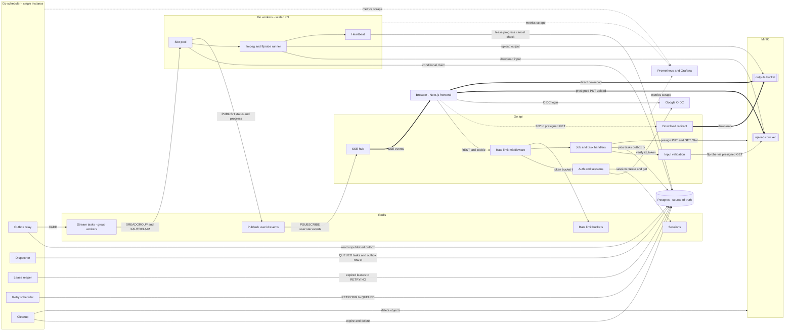

# Component Diagram

This diagram shows the logical components and the data that flows between them. Notice that the browser uploads and downloads video bytes directly to and from MinIO using presigned URLs, and that workers never call the api. Workers write to Postgres and publish to Redis, and the api relays those events to the browser over SSE. It reflects the "Backend", "Queue", "Storage", "Auth", "Rate Limiting" and "Tech Stack" sections of IMPLEMENTATION_NOTES.md.

## Notes

- Thick arrows are the bulk-data and live-event paths that bypass the api: uploads, downloads and SSE delivery to the browser.
- The api only issues presigned URLs and a 302 redirect; video bytes never pass through the Go api.
- There is no edge from workers to the api by design.
- Redis can be rebuilt from Postgres; the dispatcher and outbox relay re-enqueue QUEUED tasks.
- The download edge is drawn as redirect then direct fetch from the outputs bucket after ownership check.
