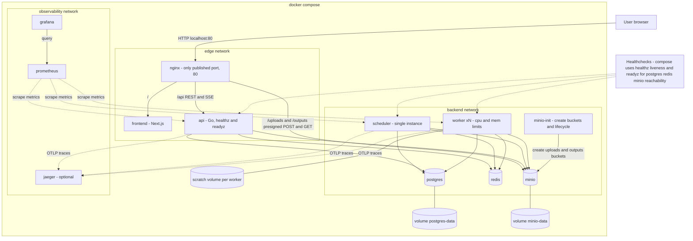

# Deployment Diagram

This diagram shows the docker compose deployment: containers, networks, volumes, healthchecks and metrics scraping. Notice that workers are replicated, resource-limited and can only reach MinIO, Postgres and Redis. The scheduler runs as a single instance. It reflects the "CPU Management", "Observability", "Health checks" and "Tech Stack" sections of IMPLEMENTATION_NOTES.md.

## Notes

- nginx is the only container with a published port (80), plus the MinIO console on 9001 in dev. MinIO sits on both the edge and backend networks so nginx and workers can reach it. See docs/NGINX.md.
- The frontend fetches client side through nginx, so it has no direct edge to the api.
- Worker reaches only minio, postgres and redis. It has no route to the api, frontend or the internet.
- Worker scratch space at /scratch is an ephemeral volume; each task directory is deleted after use, even on failure.
- Persistent volumes: postgres data and minio data. Redis is transport only and can be rebuilt from Postgres.
- Scale workers with docker compose up --scale worker=N; per-container CPU and memory limits keep ffmpeg from starving the host.
- Prometheus scrapes /metrics on api, worker and scheduler; Grafana dashboards and alert rules are provisioned from files in the repo.
- Jaeger is optional and added after logs and metrics.
- Each Go binary exposing /healthz and /readyz is an assumption for worker and scheduler; the notes specify these checks generally.
