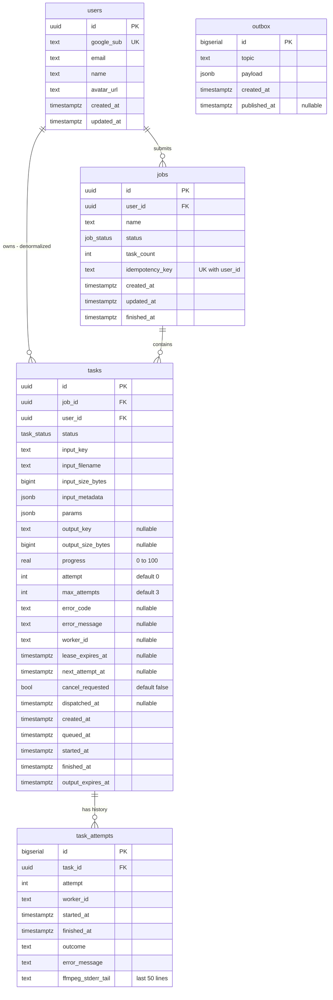

# Entity Relationship Diagram

This diagram shows the Postgres schema, the source of truth for the system. A job is what the user submits and a task is one video inside it, so a single-video job is just a job with one task. Notice that tasks carry a denormalized user_id for cheap per-user limits, and that outbox is standalone with no foreign keys. It reflects the "Database Schema" and "Statuses" sections of IMPLEMENTATION_NOTES.md.

## Notes

- Unique constraints: users.google_sub; jobs (user_id, idempotency_key).
- task_attempts.outcome values: success, retryable_error, fatal_error, lease_expired, canceled, interrupted.
- Indexes:
  - jobs (user_id, created_at desc) for dashboard and pagination
  - tasks (job_id)
  - tasks (user_id, status) for per-user limits
  - tasks (status, lease_expires_at) where status = RUNNING, for the reaper
  - tasks (status, next_attempt_at) where status = RETRYING
  - tasks (status, queued_at) where status = QUEUED, for dispatch and queue position
  - tasks (output_expires_at) where status = SUCCESS, for cleanup
  - outbox (id) where published_at is null
- job_status enum: PENDING_UPLOAD, QUEUED, RUNNING, SUCCESS, PARTIAL_SUCCESS, FAILED, CANCELED, EXPIRED
- task_status enum: PENDING_UPLOAD, QUEUED, RUNNING, RETRYING, SUCCESS, FAILED, CANCELED, EXPIRED
- Job status is derived from its tasks, never set directly.
- Sessions are stored in Redis, not Postgres, so there is no sessions table.
- Outbox rows are written in the same transaction as the state change; the relay publishes them to Redis.
